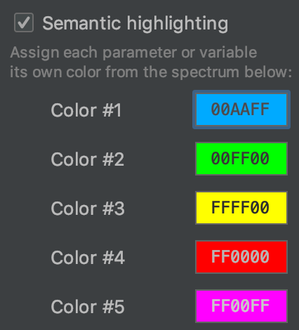

* Turn on [semantic highlighting](https://blog.jetbrains.com/pycharm/2017/01/make-sense-of-your-variables-at-a-glance-with-semantic-highlighting/)  
  * Color #1: #00AAFF
  * Color #2: #00FF00
  * Color #3: #FFFF00
  * Color #4: #FF0000
  * Color #5: #FF00FF    
  

